# Gobi MVP: Operational Shipment Coordination Platform

An operational coordination workspace for logistics companies managing domestic and cross-border freight, built as a university capstone project.

Gobi is **not** a courier app, ride-hailing platform or trucking marketplace. It is the system coordinators use to run shipments: one lifecycle, one structured event timeline, one document checklist, compliance gates before dispatch, a payments ledger and a full audit trail. It replaces the WhatsApp messages, phone calls and spreadsheets that coordinate freight today.

> **Design principle: manual first, integration ready.** Coordinators record operational events by hand today. Future GPS, customs or payment integrations write the *same* structured events automatically, so the workflow never changes.

- **Repository:** https://github.com/uwambajeddy/gobi-mvp
- **Demo video:** _link to be added_
- **Track:** FullStack (Next.js frontend, Express + PostgreSQL backend)

## Architecture

```
gobi-mvp/
├── api/    Express 4 + Sequelize 6 + PostgreSQL REST API (JWT + org RBAC, gates, audit log, Swagger, Mocha tests)
├── web/    Next.js 14 (App Router) + TypeScript + Tailwind operations workspace (NextAuth, React Query)
└── docker-compose.yml   PostgreSQL 16 with dev + test databases
```

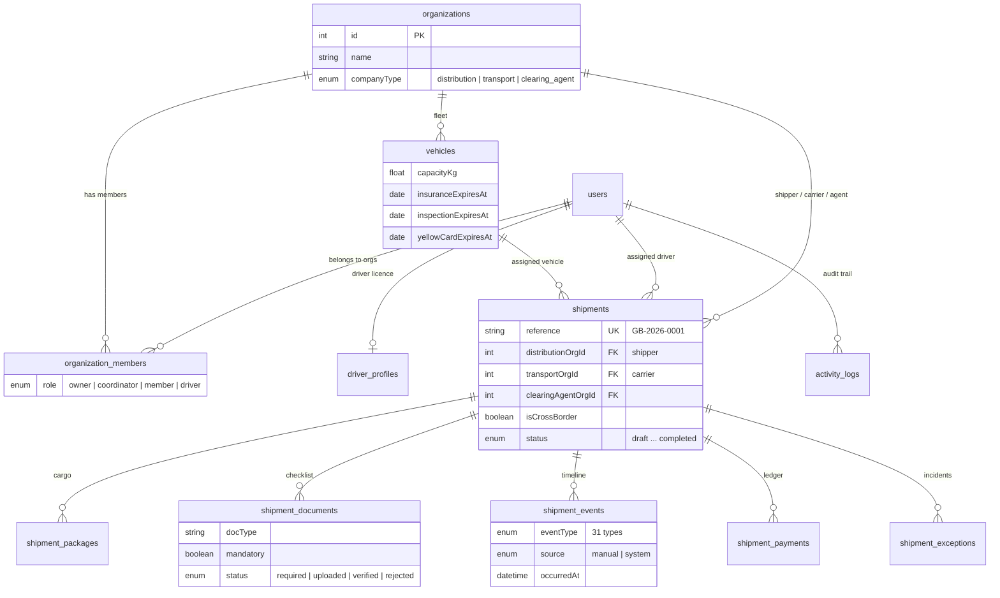

## The operational model

**Lifecycle** (condensed from the commercial 12-phase model; clearance, border and warehouse milestones live inside `in_transit` as events):

```
draft → submitted → quote_approved → awaiting_documents ⇄ documents_complete
      → execution_assigned → in_transit → arrived → delivered → completed
```

**Actors.** Every party works from the same shipment record:

| Actor | Representation | Responsibilities |
|---|---|---|
| Distribution company (shipper) | org `companyType=distribution` | Create shipments, upload commercial docs, approve quotes, confirm receipt |
| Transport company (carrier) | org `companyType=transport` | Quote, verify documents, assign vehicle+driver (gated), execute, record events, POD |
| Clearing agent | org `companyType=clearing_agent` | Customs milestones, clearance documents, duty payments |
| Coordinator | org member role `coordinator`/`owner` | The primary user, who orchestrates everything above |
| Driver | org member role `driver` + verified licence | Optional participant; coordinators can record events on their behalf |
| Receiver | plain fields + POD | Not a user; signs physically and is captured in the POD block |
| Platform admin | `users.type=admin` | Driver verification, org registry, audit trail, stats |

**The three control mechanisms:**

1. **Document Gate:** quote approval seeds a required-documents checklist (10 types; customs & corridor docs only for cross-border). Every mandatory document must be uploaded/verified and unexpired before dispatch. A rejection regresses `documents_complete` → `awaiting_documents`.
2. **Compliance Gate:** assignment is blocked on: unverified driver, expired licence, expired insurance/inspection, expired COMESA Yellow Card (cross-border), payload over vehicle capacity, or cargo above the 56,000 kg EAC GVW limit. Overrides require a written reason and are **permanently audited** with the exact failures at dispatch time.
3. **Closure rule:** completion requires POD captured and no open exceptions.

**Structured events:** 31 typed milestones (17 system-written, 14 manually recordable: pickup, checkpoints, border approached/cleared, customs submitted/released, warehouse arrived/released, arrival...). Each records who, when, where, notes and `source: manual|system`.

## Designs & screenshots

The interface is a role-aware operations workspace: a fixed sidebar whose navigation changes with the acting organization (shipper, carrier, clearing agent, driver or platform admin), an "Acting as" organization switcher, and a single shipment workspace with tabs for the timeline, documents, assignment, payments and exceptions. The data model is the ER diagram above; the screens below are captured from the running app with the seeded demo data.

| | |
|---|---|
| 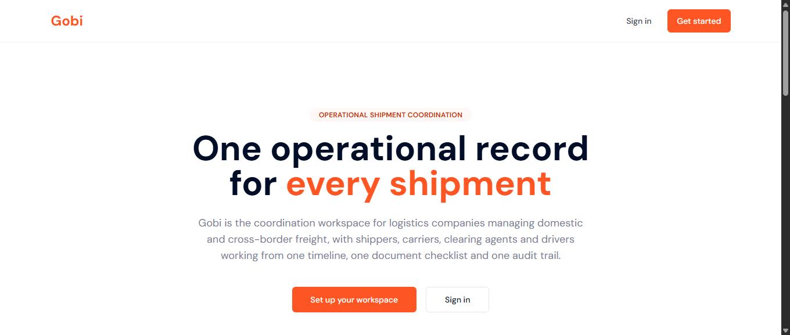 **Landing page** | 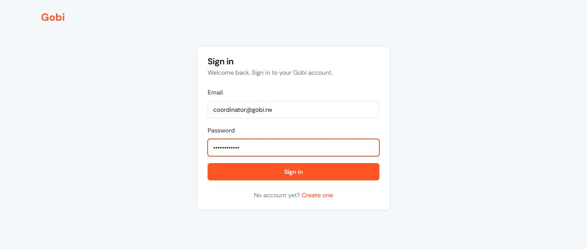 **Sign in** (NextAuth credentials) |
| 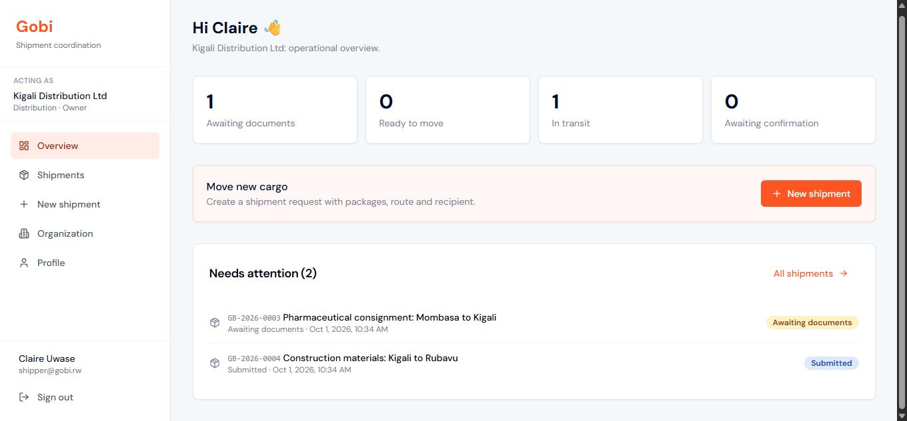 **Shipper overview:** status counters and items needing attention | 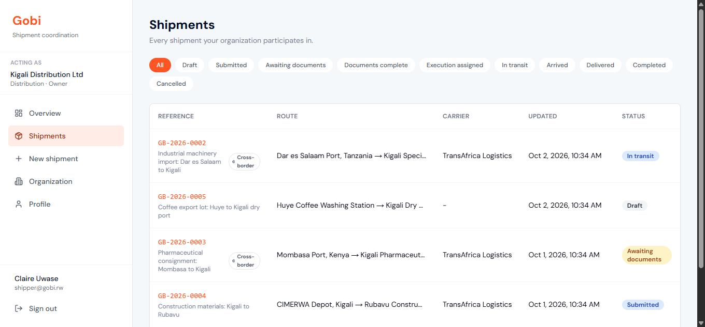 **Shipments list** filtered by lifecycle status |
| 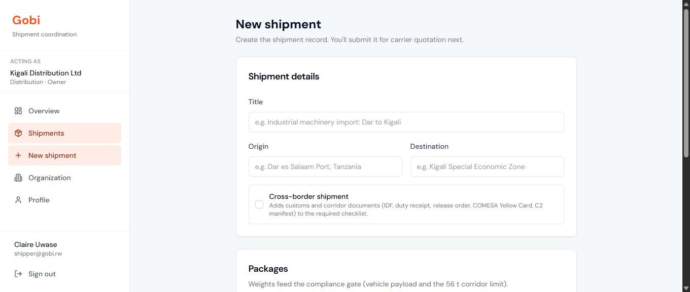 **New shipment:** cross-border toggle extends the document checklist | 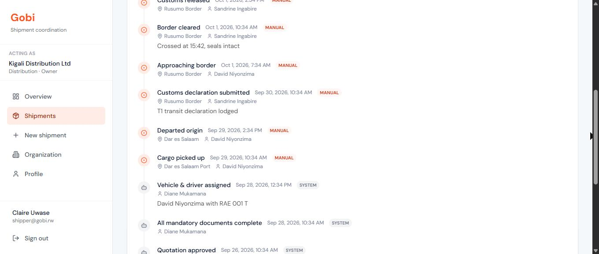 **Structured timeline:** manual and system events on the corridor |
| 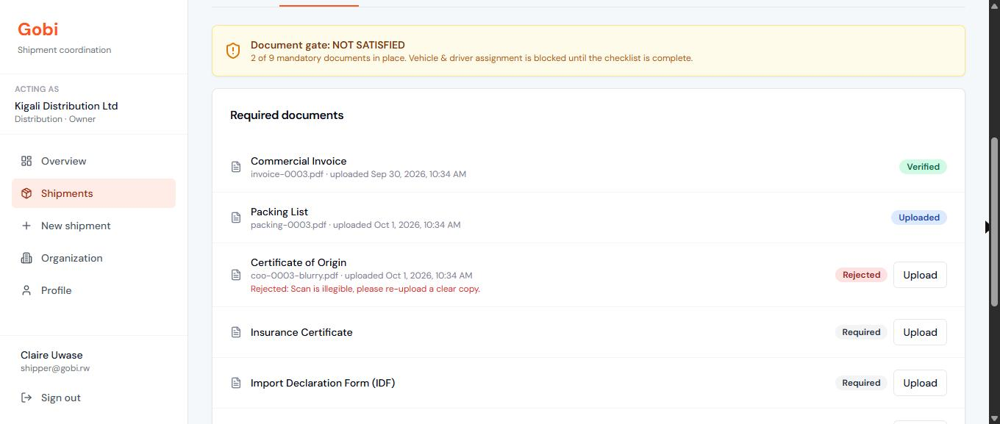 **Document Gate:** assignment blocked until mandatory documents are verified | 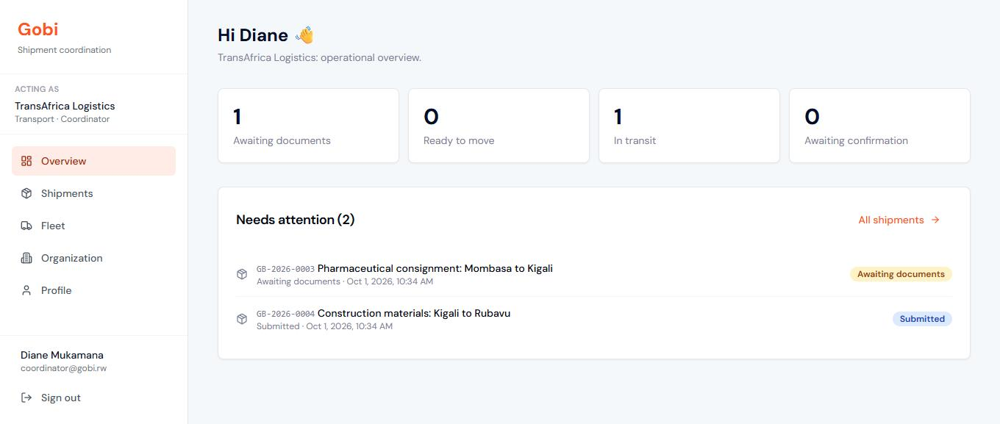 **Coordinator overview** (carrier side, with Fleet in the nav) |
| 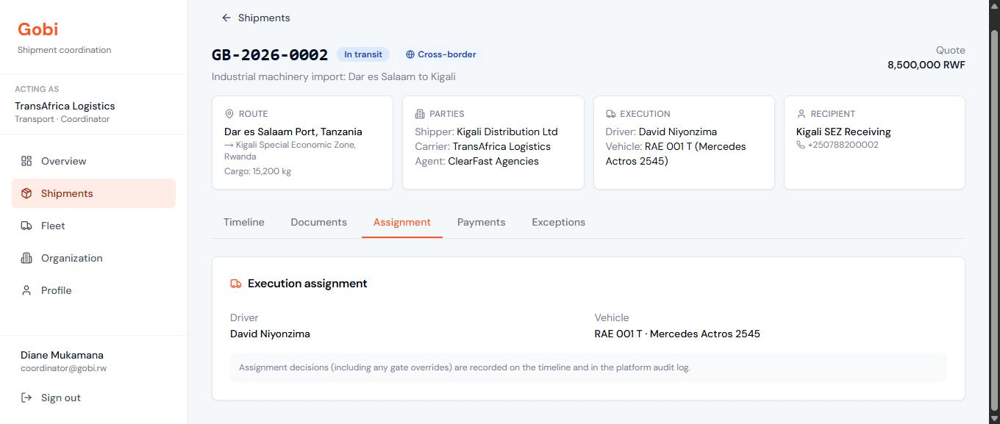 **Shipment workspace:** route, parties, execution and recipient | 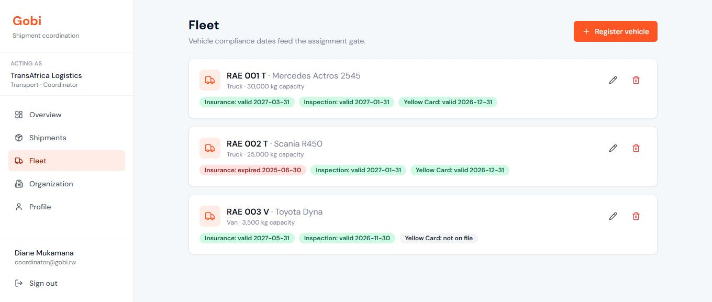 **Fleet:** insurance, inspection and Yellow Card expiry feed the Compliance Gate |
| 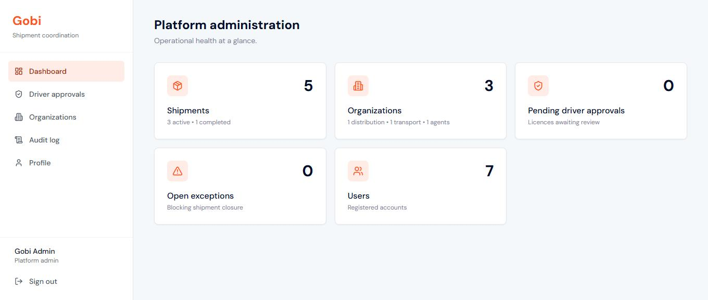 **Platform admin dashboard** | 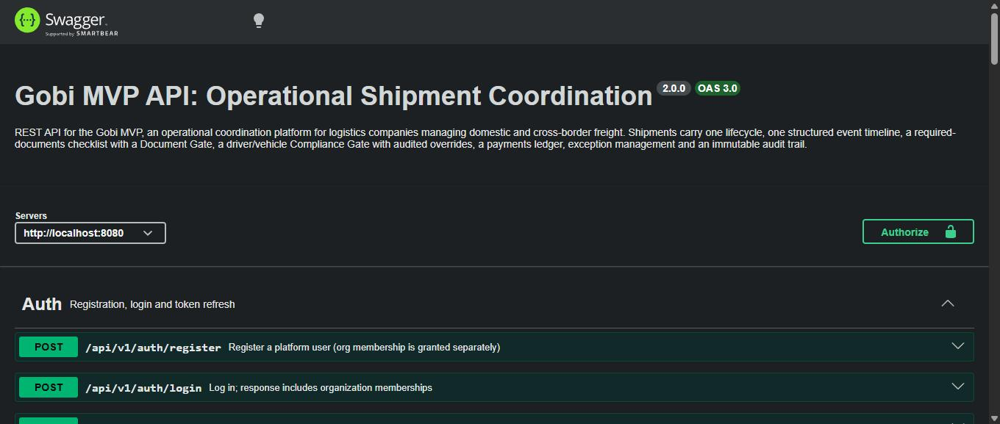 **Swagger UI** for the REST API |

## Getting started

Prerequisites: Node.js 18+, Docker Desktop.

```bash
# 1. Database: creates gobi_mvp_dev + gobi_mvp_test on localhost:5433
docker compose up -d

# 2. API
cd api
npm install
cp .env.example .env
cp .env.test.example .env.test
npm run aio          # migrate + seed + start on http://localhost:8080

# 3. Web (new terminal)
cd web
npm install
cp .env.example .env.local
npm run dev          # http://localhost:3000

# 4. Tests
cd api
npm run test:ci      # prepares the test DB then runs the Mocha suite
```

Swagger documentation: http://localhost:8080/api/v1/docs

## Seeded demo accounts

All passwords: `Password123!`

| Email | Persona |
|---|---|
| admin@gobi.rw | Platform admin (driver approvals, audit log, stats) |
| shipper@gobi.rw | Owner, **Kigali Distribution** (shipper) |
| carrier@gobi.rw | Owner, **TransAfrica Logistics** (carrier) |
| coordinator@gobi.rw | Coordinator at TransAfrica (the primary user) |
| driver@gobi.rw | Driver, licence valid ✅ |
| driver2@gobi.rw | Driver, licence **expired** ⛔ (compliance-gate demo) |
| agent@gobi.rw | Owner, **ClearFast Agencies** (clearing agent) |

Seeded fleet: `RAE 001 T` fully compliant · `RAE 002 T` insurance **expired** ⛔ · `RAE 003 V` van without a Yellow Card.

Seeded shipments: `GB-2026-0001` completed (full history) · `GB-2026-0002` cross-border **in transit** mid-corridor · `GB-2026-0003` awaiting documents (one rejected) · `GB-2026-0004` submitted with quote · `GB-2026-0005` draft.

## Demo walkthrough

1. **Shipper** (`shipper@gobi.rw`): create a cross-border shipment with packages → submit → assign TransAfrica as carrier and ClearFast as clearing agent.
2. **Coordinator** (`coordinator@gobi.rw`): submit a quote. **Shipper**: approve it and the document checklist appears.
3. Upload the mandatory documents (any party); **coordinator** verifies each one. Watch the Document Gate flip to green and the status advance to *Documents complete*. Reject one to see it regress.
4. **Coordinator** → Assignment tab: pick the expired-insurance truck + expired-licence driver and the Compliance Gate **blocks** with exact failures. Either fix the pairing (RAE 001 T + driver@) or override with a written reason (audited).
5. Record the corridor journey on the Timeline: *picked up* (status → in transit), *border approached*, *border cleared* ("Truck crossed Rusumo at 15:42"), *customs released*, *arrived at destination*.
6. Capture **POD** → shipper confirms receipt → *completed*. Try completing with an open exception first to see the closure rule.
7. **Admin** (`admin@gobi.rw`): review the audit log. Every action above is there with actor, role, organization and the gate-override evidence.

## API overview

Base URL: `http://localhost:8080/api/v1`. Full spec at `/api/v1/docs`.

| Area | Endpoints |
|---|---|
| Auth | `POST /auth/register`, `POST /auth/login`, `POST /auth/refreshToken` |
| Organizations | `POST/GET /organizations`, `GET /organizations/mine`, `GET/POST /organizations/:id/members` |
| Shipment lifecycle | `POST/GET /shipments`, `GET/PATCH /shipments/:id`, `POST /shipments/:id/submit\|cancel` |
| Award | `POST /shipments/:id/assign-carrier\|assign-clearing-agent\|quote\|approve-quote` |
| Documents | `GET/POST /shipments/:id/documents`, `PATCH /shipments/documents/:docId/verify\|reject` |
| Assignment | `GET /shipments/:id/assignment-preview`, `POST /shipments/:id/assign` (gates + audited override) |
| Timeline | `GET/POST /shipments/:id/events` |
| POD & closure | `POST /shipments/:id/pod`, `POST /shipments/:id/complete` |
| Payments | `GET/POST /shipments/:id/payments`, `PATCH /shipments/payments/:id/mark-paid` |
| Exceptions | `GET/POST /shipments/:id/exceptions`, `PATCH /shipments/exceptions/:id/resolve` |
| Fleet | `GET/POST/PATCH/DELETE /vehicles` |
| Driver | `GET/POST /driver/profile` |
| Admin | `GET/PATCH /admin/drivers`, `GET /admin/organizations`, `GET /admin/activity-logs`, `GET /admin/stats` |

Multi-org users select their acting organization with the `x-organization-id` header (set automatically by the web app's org switcher).

## Tech stack

**Backend:** Express 4, Sequelize 6 (PostgreSQL), JWT auth with organization-scoped RBAC, Joi validation, service-layer gates (document / compliance), immutable `activity_logs`, Swagger UI, Babel, Mocha + Chai + chai-http + nyc.

**Frontend:** Next.js 14 App Router, TypeScript, Tailwind CSS, NextAuth (credentials), TanStack React Query, React Hook Form + Zod, Axios with org-context header, Lucide icons.

**Tooling:** Docker Compose (PostgreSQL 16 with separate dev and test databases), sequelize-cli migrations and seeders, nodemon, ESLint (`next lint`), Git + GitHub with feature branches merged into `main`.

## Testing

```bash
cd api
npm run test:ci   # resets gobi_mvp_test (migrate + seed), then runs Mocha with nyc coverage
```

The suite covers auth, organizations and RBAC, the shipment lifecycle, document and compliance gates (including audited overrides), operations (events, payments, exceptions, POD and closure) and the admin endpoints.

Current result: **43 passing**, with 77% statement and 80% line coverage. The web app is verified with a production build (`cd web && npm run build`).

## Deployment plan

The MVP currently runs locally (Docker Compose for PostgreSQL, Node for the API and web app). Production deployment uses three managed services, chosen so each part deploys from this repository with no custom infrastructure:

| Component | Platform | Build / start | Configuration |
|---|---|---|---|
| PostgreSQL | Managed Postgres (Render or Neon) | n/a | SSL is already required by the `production` Sequelize config |
| API (`api/`) | Render web service, Node 18+ | `npm ci && npm run build` / `npm start` | `NODE_ENV=production`, `DATABASE_URL`, `JWT_ACCESS_SECRET`, `JWT_REFRESH_SECRET`, `JWT_ACCESS_TIME`, `JWT_REFRESH_TIME` |
| Web (`web/`) | Vercel (native Next.js hosting) | `npm run build` (automatic) | `NEXT_PUBLIC_API_URL` (API URL), `NEXTAUTH_URL` (web URL), `NEXTAUTH_SECRET` |

**Release steps**

1. Provision the database and copy its connection string into the API's `DATABASE_URL`.
2. Deploy the API, then run migrations as a release step: `NODE_ENV=production npx sequelize-cli db:migrate`. Seed (`npm run seed`) only on a demo environment, never on real data.
3. Deploy the web app with `NEXT_PUBLIC_API_URL` pointing at the API and a freshly generated `NEXTAUTH_SECRET`.
4. Smoke test: open `/api/v1/docs`, sign in as each persona and run the demo walkthrough above.

**Before real users**

- Add a GitHub Actions workflow that runs `npm run test:ci` against a Postgres service container and `npm run build` for the web app on every pull request.
- Restrict CORS on the API to the web app's origin (it is open for local development).
- Store document files in object storage (S3 or Cloudinary). The API already records document metadata and a `fileUrl`, so only the upload step changes.
- Generate long random JWT and NextAuth secrets per environment, and enable automated database backups.

## License

ISC (academic project).
